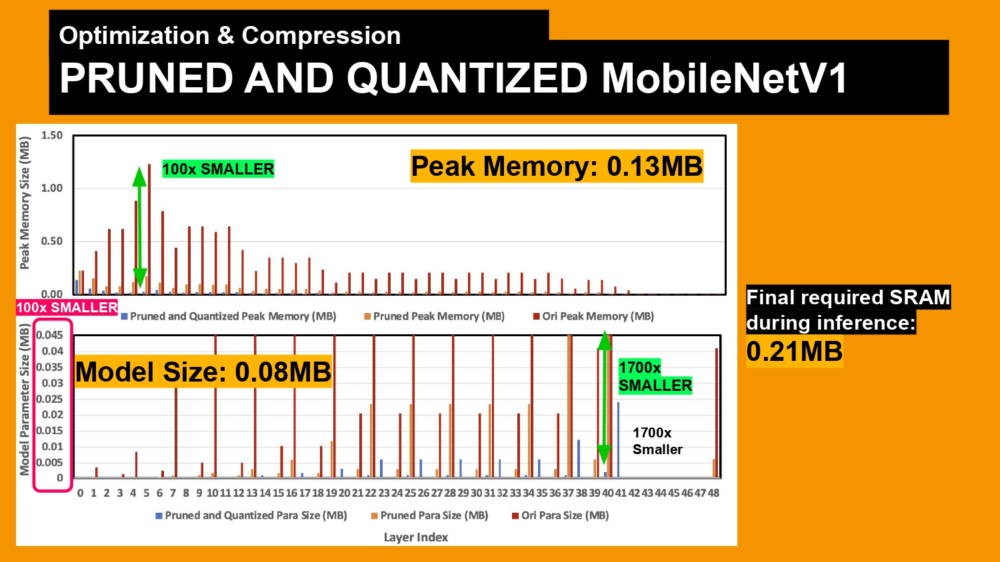

# On-Device-CNN

## Table of Contents
- [Introduction](#Introduction)
- [Experiment Result](#Experiment_Result)
- [Installation](#Installation)
- [Usage](#Usage)
- [Models](#Models)
- [RelativeProject](#Relative_Project)
- [Contributing](#Contributing)
- [License](#License)

<a id="Introduction"></a>

## Introduction
This project develops and deploys an effective deep-learning model on a Cortex-M4 microcontroller - Sony Spresense for real-time traffic light image classification. The model, successfully trained and quantized for on-device deployment, delivers an accuracy of 90%, and 500ms latency. 

<p align="center">
  
</p>

<a id="Experiment_Result"></a>

## Experiment Result

<p align="center">
  
</p>

| MobilenetV1  | Accuracy     | Memory Usage | Latency |
|----------|-------------|------------|--------------|
| Original | 99% | 14 MB      | N/A        |
| Pruned 85% | 95%       | 0.55MB5     | .8 s        | 
| Pruned 85% + Quant | 90%   | 0.21 MB     | .55 s        | 


<a id="Installation"></a>

## Installation
To install the required dependencies, follow these steps: 
1. Clone this repository:

```bash
git clone https://github.com/MIC-Laboratory/On-device-CNN
```
 
2. Navigate to the project directory:
```bash
cd On-device-CNN
```

3. Install the dependencies:
```bash
pip install -r requirements.txt
```

<a id="Usage"></a>

## Usage
To use this project, follow these steps:

1. Configure the training parameters: 
    - Open the config.yaml file and set the desired hyperparameters such as batch size, learning rate, and number of epochs. 
    - Modify other settings such as model type, dataset path, and output directory if needed.

2. Train the model: 
    - Run the training script: 
        ```bash
        python training.py
        ``` 
    - Monitor the training progress and observe the log output.

3. Generate C header file
    - Run OnDeviceDepolyment.py
        ```bash
        python OnDeviceDepolyment.py
        ```        

    It will generate Onnx model files, TensorFlow model files, and a C header file. We need to import the C header file on Arduino in order to access our model on microcontroller

4. Flash the Arduino .ino file to the microcontroller.
5. Run the listener.py file to start the real-time traffic light classification.

<a id="Models"></a>

## Models
This project includes the following pre-defined models:

- [MobilenetV1](https://arxiv.org/pdf/1704.04861.pdf)

The model is defined in separate Python files - mobilenetv1.py
 


<a id="Relative_Project"> </a>

## Relative Project
[Pruning-Engine](https://github.com/MIC-Laboratory/Pruning-Engine)


[Pytorch-Cifar](https://github.com/MIC-Laboratory/Pytorch-Cifar)


## Contributing
We welcome contributions from the community to improve this project. If you encounter any issues or have suggestions for enhancements, please feel free to submit a pull request or open an issue on the GitHub repository.

## License
This project is licensed under the MIT License.
